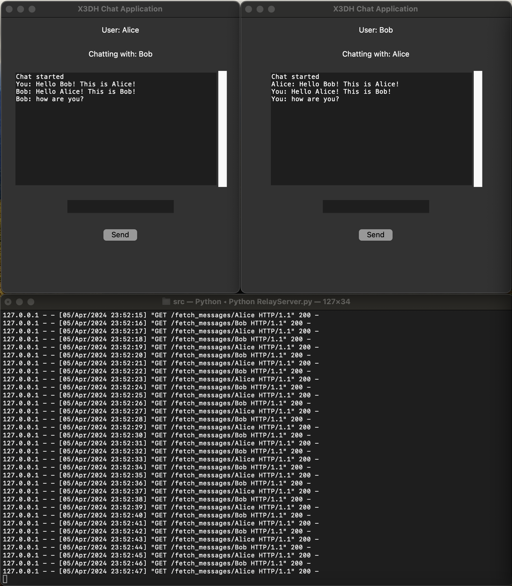

### Extended Triple Diffie-Hellman Protocol with Double Ratcheting
#### Secure Messaging Application

This project implements a secure messaging application using modern cryptographic principles, including the Modulo-based Diffie-Hellman Exchange, Extended Triple Diffie-Hellman (X3DH) Public Key Exchange method, and Double Ratcheting for Forward Secrecy. These protocols provide robust security measures for end-to-end encrypted messaging, similar to those found in popular messaging applications like WhatsApp and Signal.

The foundational Diffie-Hellman Key Exchange protocol was introduced in the seminal paper by Whitfield Diffie and Martin Hellman, which you can read [here](https://www-ee.stanford.edu/~hellman/publications/24.pdf). The X3DH and Double Ratcheting algorithms, developed by Signal, further extend this framework to offer enhanced security features for asynchronous messaging environments.

### Features

- **Secure Communication**: Utilizes Modulo-based Diffie-Hellman and [Extended Triple Diffie-Hellman Key Exchange](https://signal.org/docs/specifications/x3dh/) for secure generation of shared secrets.
- **Forward Secrecy**: Incorporates [Double Ratcheting](https://signal.org/docs/specifications/doubleratchet) mechanisms to ensure that the compromise of one message's encryption keys does not lead to the compromise of all subsequent keys.
- **User-Friendly Interface**: Includes a UI-based text messaging demonstration application for ease of use.

### Project Structure

The project is structured into several key components:

- `x3dh-double-ratchet/src/Application.py`: A user interface for text messaging, demonstrating the application of the secure messaging protocols.
- `x3dh-double-ratchet/src/User.py`: The user class containing the implementation of the X3DH and Double Ratcheting protocol functions.
- `x3dh-double-ratchet/src/DiffieHellmanUtils.py`: Utilities for Diffie-Hellman key creation, shared secret calculations, and other cryptographic functions.
- `x3dh-double-ratchet/src/RelayServer.py`: A Flask-based relay web server that provides the underlying messaging infrastructure.
- `x3dh-double-ratchet/test`: Contains test files for verifying the correctness and security of the cryptographic implementations.

#### Installation

##### Prerequisites

- Python 3.6 or later installed on your system.

##### Setting Up a Virtual Environment

It's recommended to use a virtual environment for running this project to manage dependencies efficiently. To set up and activate a virtual environment, follow these steps:

```bash
python3 -m venv venv
source venv/bin/activate
```

##### Installing Dependencies

Install the required Python libraries by running:

```bash
pip install -r requirements.txt
```

##### Running the Application

1. **Start the Relay Server**: First, ensure the Flask-based relay server is running by executing the following commands in a terminal (within the virtual environment):

```bash
cd src
python3 RelayServer.py
```

To check and free the port used by the relay server (if necessary), you can use:

```bash
sudo lsof -i :5020
kill -9 [PID]
```

Replace `[PID]` with the process ID using the port `5020`.

2. **Launch User Applications**: In two separate terminal windows (each with the virtual environment activated), navigate to the `src` directory and start the UserApplication:

```bash
python3 UserApplication.py
```

Repeat the command in the second terminal to simulate another user.

3. **Using the Application**: Once both the RelayServer and the UserApplications are running:
    - In each UserApplication terminal, select a unique username when prompted. This registers the application with the server.
    - Once both applications are registered, enter the recipient ID (username of the other user) in one of the terminals to start a chat session.
    - You can now exchange messages securely.

### Testing

Testing involves verifying that the RelayServer and UserApplications can communicate effectively and that messages are securely encrypted and decrypted as intended. There are no automated test scripts provided in the `/test` directory for end-to-end testing; manual testing by running multiple instances of the UserApplication as described above is recommended.

Here is an sample application run screenshot: 
